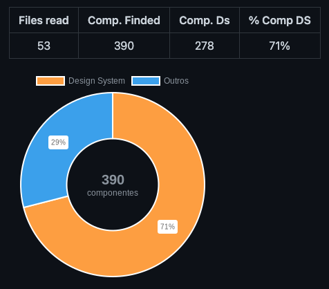

# 📏 Design System Metrics

### Como metrificar o uso do meu Design System no meu produto?

Essa também era a minha dúvida! Pensando nisso, essa biblioteca foi criada com o objetivo de gerar uma documentação simples com algumas métricas sobre o uso do meu `Design System` dentro de um produto.

## 📖 Índice

1. [📌 Exemplo](#-exemplo)
2. [📊 Métricas Geradas](#-métricas-geradas)
3. [🚀 Como Usar](#-como-usar)
4. [⚙️ Parâmetros](#-parâmetros)

## 📌 Exemplo

> Se quiser ver um exemplo completo, [clique aqui](src/assets/metrics-ds/METRICS.md)!



## 📊 Métricas Geradas

Até o momento, estas são as métricas geradas em documentação simples nos formatos Markdown e JSON:

-  ✅ Total de arquivos lidos
-  ✅ Total de componentes encontrados
-  ✅ Total de componentes do Design System encontrados e utilizados
-  ✅ Total de outros componentes encontrados e utilizados
-  ✅ Percentual de componentes do Design System utilizados
-  ✅ Top 10 componentes do Design System mais utilizados
-  ✅ Total e percentual de componentes do Design System por página
-  ✅ Percentual de páginas com pelo menos um componente do Design System
-  ✅ Qual página tem mais componentes do Design System sendo usados
-  ✅ Média de componentes do Design System por página

## 🚀 Como Usar

Veja como adicionar essa biblioteca ao seu projeto de forma simples:

### 1️⃣ Instale a biblioteca no seu projeto

```sh
yarn add -D design-system-metrics
```

### 2️⃣ Crie um arquivo `.js` chamado `metrics-ds` na raiz do seu projeto

```sh
metrics-ds.js
```

### 3️⃣ Adicione o seguinte código ao arquivo criado

```js
const { generateMetrics } = require("design-system-metrics");

generateMetrics({
   dirRead: ["./src/pages"],
   extensions: ["tsx"],
   prefixDs: "DS",
   regexToSearchComponent: / <([A-Z])\w+[ ,>,\w]/g, // <Component
});
```

### 4️⃣ Adicione o seguinte script ao seu `package.json`

```json
"metrics-ds": "node metrics-ds.js"
```

### 5️⃣ Agora é só rodar o comando no terminal

```sh
yarn metrics-ds
```

## ⚙️ Parâmetros

| Nome                    | Tipo     | Descrição                                     | Padrão       | Obrigatório |
| ----------------------- | -------- | --------------------------------------------- | ------------ | ----------- |
| output                  | string   | Define o diretório de saída da documentação   | ./metrics-ds | false       |
| dirRead                 | string[] | Lista de diretórios a serem lidos (recursivo) |              | true        |
| extensions              | string[] | Lista de extensões de arquivos a serem lidos  |              | true        |
| prefixDs                | string   | Prefixo do seu Design System                  |              | true        |
| regexToSearchComponent  | RegExp   | Expressão regular para buscar componentes     |              | true        |
| ignoreComponent         | string[] | Lista de componentes a serem ignorados        |              | false       |
| showChartGeneral        | boolean  | Opção para exibir gráfico na documentação     | true         | false       |
| showChartCountComponent | boolean  | Opção para exibir gráfico na documentação     | true         | false       |
| showUrl                 | boolean  | Opção para adicionar URL para abrir o arquivo | true         | false       |
| buildJson               | boolean  | Opção para gerar documentação em JSON         | true         | false       |
| buildMarkdown           | boolean  | Opção para gerar documentação em Markdown     | true         | false       |
| language                | string   | Define o idioma da documentação               | 'pt-BR'      | false       |
