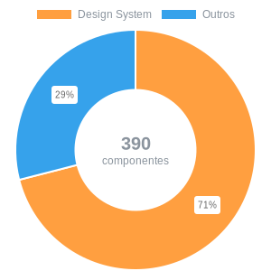
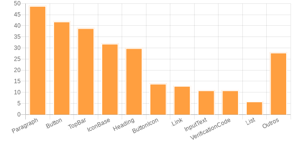

# DS metrics

See some quantitative metrics and percentages that the \`Design system\` is used within this product

- [Grand total](#grand-total)
- [Total per Component](#total-per-component)
- [Total per page](#total-per-page)
- [Average of pages](#average-of-pages)
- [Configuration](#configuration) 

### Grand total

> An overview of everything found from the \`Design system\` within this product

|Files read|Comp. Finded|Comp. Ds|% Comp DS|
|:--:|:--:|:--:|:--:|
| 53 | 390 | 278 | 71% | 

 

### Total per Component

> A view of which component was most used within the product

|Component|Total|
|--|:--:|
| DbsbParagraph | 49 |
| DbsbButton | 42 |
| DbsbTopBar | 39 |
| DbsbIconBase | 32 |
| DbsbHeading | 30 |
| DbsbButtonIcon | 14 |
| DbsbLink | 13 |
| DbsbInputText | 11 |
| DbsbVerificationCode | 11 |
| DbsbList | 6 |
| Outros | 28 |

 

### Total per page

> A view of the percentage of \`Design System\` components used per page

|Page|Total|Design System|Others|DS percentage|
|--|:--:|:--:|:--:|:--:|
|Page01|7|5|2|71%|
|Page02|8|6|2|75%|
|Page03|7|5|2|71%|
|Page04|7|5|2|71%|
|Page05|9|3|6|33%|
|Page06|6|4|2|67%|
|Page07|6|6|0|100%|
|Page08|12|9|3|75%|
|Page09|10|3|7|30%|
|Page010|4|3|1|75%|
|Page011|1|1|0|100%|
|Page012|7|6|1|86%|
|Page013|7|5|2|71%|
|Page014|7|6|1|86%|
|Page015|6|5|1|83%|
|Page016|6|5|1|83%|
|Page017|11|9|2|82%|
|Page018|8|6|2|75%|
|Page019|6|6|0|100%|

### Average of pages

> A view of page averages with \`Design system\` within this product

|Page. c/+ Comp DS|Average Comp. DS Page|% of page with DS|
|:--:|:--:|:--:|
| Page09 (10) | 5.25 | 98.11% |

### Configuration

> Below the settings that were used to generate this file

|Prefix DS|Extension|Regex|
|--|--|--|
| Dbs | tsx | / <([A-Z])\w+[ ,>,\w]/g | 

#### Directory Searched
 - `/src/pages` 

#### Ignored Components
 - `DbsSpace` 
